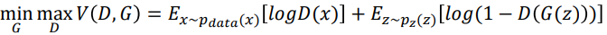

# Generative Adversarial Networks (GAN)

### GAN이란?


Generator(G) 는 가짜 데이터를 생성하고, Discriminator(D)는 데이터가 진짜인지 가짜인지 판별한다.

- G가 실제와 같은 가짜 데이터를 생성(Generative)하며, G와 D가 적대적(Adversarial)으로 훈련한다.
- 결국에는 생성된  가짜 데이터에 대해 D가 정확한 판별을 할 수 없게 된다.

가짜 데이터의 분포가 실제 데이터의 분포를 닮아가며, 진짜같은 가짜 데이터를 무제한으로 생성해낼 수 있다.


- 훈련의 일환으로 Supervised loss function을 사용하는 Unsupervised learning 알고리즘. ([Link](https://stackoverflow.com/questions/44445778/are-gans-unsupervised-or-supervised))
  - 생성한 데이터를 진짜 데이터인지 판별 -> Supervised component, 그러나 이것이 목적이 아님


### Generator & Discriminator


- 랜덤 데이터 z를 받아, Generator의 각 노드마다 Weights와 Bias를 거쳐 진짜같은 가짜데이터 G(z) 생성

- G(z)는 Discriminator의 입력이 된다. 이것이 Disciminator를 거쳐, 진위 여부(진짜, 가짜 - binary)를 판단하게 되는 것이다.

  - sigmoid를 거쳐 진짜면 1, 가짜면 0을 출력

  - Generator에서와 마찬가지로 Discriminator의 각 노드마다 Weights와 Bias를 거쳐서 최종 결과로 출력(sigmoid)


### Loss function

Discriminator(D)와 Generator(G)를 학습시키기 위해 아래의 로스함수를 이용한다.



- D는 실제 데이터(G(x))를 1로, 가짜 데이터(D(G(z)))를 0으로 판별하도록 학습한다.

  - 로스함수가 최대가 되도록 학습한다. 실제 데이터가 1, 가짜 데이터가 0인 경우 위의 로스함수는 최대값을 갖는다.

- G는 D가 가짜 데이터(G(z))를 1로 판별하도록 학습한다.

  - 로스함수가 최소가 되도록 학습한다. 가짜 데이터가 1인 경우, 위의 로스함수는 최소값을 가진다.

  즉, Generator는 최소화 시키면서 Discriminator는 최대화한다.


### 예제 코드 리뷰

##### 8-1) GAN with tensorflow

- 1차원 정규분포에서 샘플링한 데이터를 모방한 가짜 데이터를 생성한다.

- 이 가짜 데이터는 실제 데이터의 속성(정규분포)를 갖게 될 것이다.

```python

```


##### 예제 8-2) GAN with keras

- keras에서는 model.fit() or model.train_on_batch() 함수에서 target값을 지정해주어야 한다.

  (위의 함수들은 Supervised learning을 목적으로 만들어진 함수)

- 따라서, keras에서는 GAN을 학습하기 위해 Supervised learning 방식으로 바꾸어 진행한다.
  
  - 즉, binary_crossentropy loss함수를 사용한다.


##### 사용된 라이브러리

```python
from tensorflow.keras.models import Model
from tensorflow.keras.layers import Input, Dense
from tensorflow.keras.optimizers import RMSprop, Adam
from tensorflow.keras import backend as K #1)
import numpy as np
import matplotlib.pyplot as plt
import seaborn as sns
import tensorflow as tf
tf.compat.v1.disable_eager_execution() #2)

# 정규분포로부터 데이터를 샘플링한다.
realData = np.random.normal(size=1000)
realData = realData.reshape(realData.shape[0], 1)
nDInput = realData.shape[1]
nDHidden = 32
nDOutput = 1
nGInput = 16
nGHidden = 32
nGOutput = nDInput
```

1) 케라스에 구현되지 않은 것을 텐서플로우처럼 low-level에서 접근이 가능하게 하는 라이브러리

2) tf 버전 1.x에서는 그래프 생성을 완료한 뒤, Session으로 그래프를 실행했다.

- 속도가 빠르지만 코딩이 어렵다.

현재 사용하는 tf 버전 2.x에서는 그래프를 생성과 동시에 실행한다.

- 속도가 느리지만 코딩이 편리하다.

~~지금은 for문을 바깥에서 돌리면서, 에포크 1번씩을 학습시키는 것이다. 이 방식은 속도가 늦다.~~
~~따라서 그래프를 생성한 뒤 한번에 실행시키는 방법을 사용하기 위해서 이 설정을 해준다.~~??

이 명령어를 통해서 버전 1.x의 방식처럼 전해준다.(속도가 빨라진다.)

-----

-----
##### Discriminator & Generator 생성
```python
# Discriminator를 생성한다.
def BuildDiscriminator():
    x = Input(batch_shape = (None, nDInput))
    h = Dense(nDHidden, activation = 'relu')(x)
    Dx = Dense(nDOutput, activation = 'sigmoid')(h)
    model = Model(x, Dx)
    model.compile(loss = 'binary_crossentropy', optimizer = Adam(0.001))
    return model

# Generator를 생성한다.
def BuildGenerator():
    z = Input(batch_shape = (None, nGInput))
    h = Dense(nGHidden, activation = 'relu')(z)
    Gz = Dense(nGOutput, activation='linear')(h)
    return Model(z, Gz)

def getNoise(m, n=nGInput):
    z = np.random.uniform(-1., 1., size=[m, n])
    return z

# 두 분포 (P, Q)의 KL divergence를 계산한다.
def KL(P, Q):
    # 두 데이터의 분포를 계산한다
    histP, binsP = np.histogram(P, bins=100)
    histQ, binsQ = np.histogram(Q, bins=binsP)
    
    # 두 분포를 pdf로 만들기 위해 normalization한다.
    histP = histP / (np.sum(histP) + 1e-8)
    histQ = histQ / (np.sum(histQ) + 1e-8)
    
    # KL divergence를 계산한다
    kld = np.sum(histP * (np.log(histP + 1e-8) - np.log(histQ + 1e-8)))
    return kld

def getNoise(m, n=nGInput):
    z = np.random.uniform(-1., 1., size=[m, n])
    return z
```

##### GAN 생성 & 학습 준비

```python
def BuildGAN(D, G):
    D.trainable = False #1)
    z = Input(batch_shape=(None,nGIput))
    Gz = G(z) #2)
    DGz = D(Gz)
    
    model = Model(z, DGz)
    model.compile(loss = 'binary_crossentropy'), optimizer = Adam(0.0005)
    return model

K.clear_session() #3)

Discriminator = BuildDiscriminator()
Generator = BuildGenerator()
GAN = BuildGAN(Discriminator, Generator)

nBatchCnt = 3 # Mini-batch를 위해 input 데이터를 n개 블록으로 나눈다.
nBatchSize = int(realData.shape[0] / nBatchCnt)  # 블록 당 Size
```

(1) 앞서 compile 옵션을 설정했던 discriminator는 업데이트하지 않는다.

그동안 명시하지 않았어도 .trainable = True로 자동설정되어 모든 모델을 업데이트했는데, 이번의 경우에는 False로 설정하여 앞서 

(2) G라는 모델에 z를 입력으로 넣는다.

(3) ~~## 커널을 리스타트해도 그래프에 인풋 자료가 남아있다(?) 서머리를 해주는 경우 input_2. 리스타트 안하면 뒤의 숫자가 계속해서 증가하는데, 이것을 방지해준다.~~??

##### 모델 학습

```python
for epoch in range(1000):
    # Mini-batch 방식으로 학습한다.
    for n in range(nBatchCnt):
        # input 데이터를 Mini-batch 크기에 맞게 자른다.
        nFrom = n * nBatchSize
        nTo = n * nBatchSize + nBatchSize
        
        # 마지막 루프이면 nTo는 input 데이터의 끝까지.
        if n == nBatchCnt - 1:
            nTo = realData.shape[0]
                
        # 학습 데이터를 준비한다.
        bx = realData[nFrom : nTo]
        bz = getNoise(m=bx.shape[0], n=nGInput)
        Gz = Generator.predict(bz)

        # Discriminator를 학습한다.
        # Real data가 들어가면 Discriminator의 출력이 '1'이 나오도록 학습하고,
        # Fake data (Gz)가 들어가면 Discriminator의 출력이 '0'이 나오도록 학습한다.
        target = np.zeros(bx.shape[0] * 2)
        target[ : bx.shape[0]] = 0.9     # '1' 대신 0.9로 함
        target[bx.shape[0] : ] = 0.1     # '0' 대신 0.1로 함
        bx_Gz = np.concatenate([bx, Gz]) 
        ## bx(333,1)은 진짜 데이터이고, Gz(333,1)은 generator함수를 통해 가짜 데이터가 생성된 것.
		## 진짜 데이터는 0.9, 가짜 데이터는 0.1이 되도록 (진짜데이터: 가짜데이터)의 x, y값을 fit(train_on_batch)함수의 			  인자로 설정해준다.
        Dloss = Discriminator.train_on_batch(bx_Gz, target)
        
        # Generator를 학습한다.
        # Fake data (z --> Gz --> DGz)가 들어가도 Discriminator의 출력이 '1'이
        # 나오도록 Generator를 학습한다.
        target = np.zeros(bx.shape[0])
        target[:] = 0.9
        Gloss = GAN.train_on_batch(bz, target)
        
    if epoch % 10 == 0:
        z = getNoise(m=realData.shape[0], n=nGInput)
        fakeData = Generator.predict(z)
        kd = KL(realData, fakeData)
        print("epoch = %d, D-Loss = %.3f, G-Loss = %.3f, KL divergence = %.3f" % (epoch, Dloss, Gloss, kd))
```


# 새롭게 알게된 것

