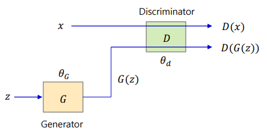
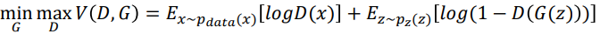

# Generative Adversarial Networks (GAN)

### GAN이란?



#### Loss function

Discriminator(D)와 Generator(G)를 학습시키기 위해 아래의 로스함수를 이용한다.



- D는 실제 데이터(x)를 1로, 가짜 데이터를 0으로 판별하도록 학습한다.

  - 로스함수가 최대가 되도록 학습한다. 실제 데이터가 1, 가짜 데이터가 0인 경우 위의 로스함수는 최대값을 갖는다.

- G는 D가 가짜 데이터(G(z))를 1로 판별하도록 학습한다.

  - 로스함수가 최소가 되도록 학습한다. 가짜 데이터가 1인 경우, 위의 로스함수는 최소값을 가진다.

  즉, Generator는 최소화 시키면서 Discriminator는 최대화한다.


### 코드 리뷰

##### 8-1)

```python

```

